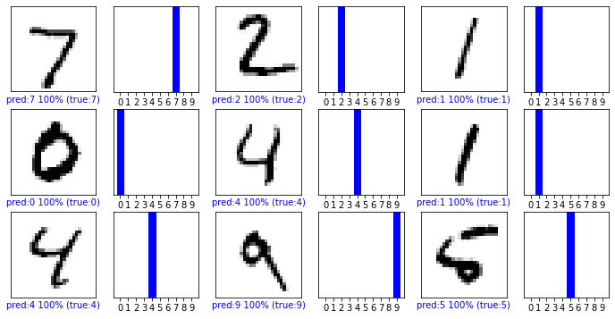
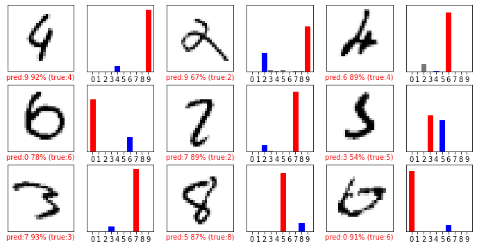

# MNIST reinterpreted by Eli

* Basic code: https://www.tensorflow.org/overview
* plot method: https://www.tensorflow.org/tutorials/load_data/images
* visualization for mnist: https://webnautes.tistory.com/1232

## Import required module


```python
import tensorflow as tf
mnist = tf.keras.datasets.mnist
```

## Preprocess training data
since black images are set to RGB 0-255 integer, normalize it to 0-1 range for keras model


```python
(x_train, y_train),(x_test, y_test) = mnist.load_data()
x_train,x_test = x_train/255.0, x_test/255.0
```

### set class names
keras sequential model will automatically sort class label with alphabetical order


```python
import numpy
class_names = numpy.unique(y_train)
print(class_names)
```

    [0 1 2 3 4 5 6 7 8 9]
    

### test data shape


```python
print(type(x_train))
print(x_train.shape)
print(x_train[1].shape)
print(y_train.shape)
```

    <class 'numpy.ndarray'>
    (60000, 28, 28)
    (28, 28)
    (60000,)
    

### train data plot


```python
import matplotlib.pyplot as plt
fig1= plt.figure(figsize=(10,10))
fig1.patch.set_facecolor('xkcd:white')
for i in range(9):
    ax = plt.subplot(3,3,i+1)
    plt.imshow(x_train[i],cmap='Greys')
    plt.title('true label: {}'.format(y_train[i]))
    plt.axis('off')
```


    

    


## Setup keras model
each mnist image is consist of 28,28 size => pipeline 1  
pipeline 1 => make keras network with 128 units, and activation function as relu => pipeline2  
pipeline 2 => make 20% of nodes to 0 to prevent overfitting => pipeline 3  
pipeline 3 => make keras network with 10 nodes, activation function as softmax  

input size = 60000  
layer1 = 128 nodes  
output size = 10 (mnist number of label 0-9)
- [X] number of last layer should be same as the number of category unit  

category unit will be determined at future compile method: sparse_categorical_crossentropy


```python
model = tf.keras.models.Sequential([
    tf.keras.layers.Flatten(input_shape=(28,28)),
    tf.keras.layers.Dense(128, activation='relu'),
    tf.keras.layers.Dropout(0.2),
    tf.keras.layers.Dense(10,activation='softmax')
])
```

### summary of model
784+1(bias) * 128 = 100480  
128+1(bias) * 10 = 1290


```python
model.summary()
```

    Model: "sequential"
    _________________________________________________________________
    Layer (type)                 Output Shape              Param #   
    =================================================================
    flatten (Flatten)            (None, 784)               0         
    _________________________________________________________________
    dense (Dense)                (None, 128)               100480    
    _________________________________________________________________
    dropout (Dropout)            (None, 128)               0         
    _________________________________________________________________
    dense_1 (Dense)              (None, 10)                1290      
    =================================================================
    Total params: 101,770
    Trainable params: 101,770
    Non-trainable params: 0
    _________________________________________________________________
    

## Specify optimizer and a loss function
ref: https://keras.io/getting_started/intro_to_keras_for_engineers/#training-models-with-fit  
for loss function(great article!!):  https://gombru.github.io/2018/05/23/cross_entropy_loss/  


```python
model.compile(optimizer='adam',
              loss='sparse_categorical_crossentropy',
              metrics = ['accuracy'])
```

## Start fitting process


```python
model.fit(x_train,y_train,epochs=10)
```

    Epoch 1/10
    1875/1875 [==============================] - 2s 914us/step - loss: 0.4928 - accuracy: 0.85591s - loss: 0.7431 - accura - ETA: 0s - loss: 0.6594 - accuracy:  - ETA: 0s - loss: 0.6171 - accuracy: 0.81 - ETA: 0s - loss: 0.6043 - accuracy: 0.82 - ETA: 0s - loss: 0.5919 - accuracy: 0.82 - ETA: 0s - loss: 0.5808 - accuracy: 0. - ETA: 0s - loss: 0.5609 - accuracy: 0. - ETA: 0s - loss: 0.5425 - accuracy: 0.84 - ETA: 0s - loss: 0.5341 - accuracy - ETA: 0s - loss: 0.5040 - accuracy: 0.
    Epoch 2/10
    1875/1875 [==============================] - 2s 946us/step - loss: 0.1498 - accuracy: 0.95531s - loss: 0.1892 - accuracy: 0.93 - ETA: 1s - loss: 0.1838 - accuracy: 0.94 - ETA: 1s - loss: 0.1785 - accuracy: 0.94 - ETA: 1s - loss: 0.1740 - accuracy - ETA: 1s - loss: 0.1629 - accuracy: 0. - ETA: 1s - loss: 0.1600 - accuracy: 0. - ETA: 1s - loss: 0.1578 - accuracy: 0.95 - ETA: 1s - loss: 0.1568 - accuracy: 0. - ETA: 1s - loss: 0.1554 - accuracy:  - ETA: 0s - loss: 0.1539 - accuracy: 0. - ETA: 0s - loss: 0.1531 - accuracy: 0. - ETA: 0s - loss: 0.1525 - accuracy: 0.95 - ETA: 0s - loss: 0.1522 - accuracy: 0.95 - ETA: 0s - loss: 0.1520 - accuracy:  - ETA: 0s - loss: 0.1513 - accuracy: 0.95 - ETA: 0s - loss: 0.1511 - accuracy: 0.95 - ETA: 0s - loss: 0.1509 - accuracy:  - ETA: 0s - loss: 0.1503 - accuracy: 0.95 - ETA: 0s - loss: 0.1501 - accuracy: 0.95 - ETA: 0s - loss: 0.1499 - accuracy: 0.95
    Epoch 3/10
    1875/1875 [==============================] - 2s 908us/step - loss: 0.1114 - accuracy: 0.96521s - loss: 0.1092 - accuracy: 0.96 - ETA: 1s - loss: 0.1140 - accuracy: 0. - ETA: 1s - loss: 0.1175 - accuracy:  - ETA: 1s - loss: 0.1163 - accuracy: 0.96 - ETA: 1s - loss: 0.1162 - accu - ETA: 0s - loss: 0.1141 - accuracy: 0. - ETA: 0s - loss: 0.1138 - accuracy: 0.96 - ETA: 0s - loss: 0.1137 - accuracy: 0.96 - ETA: 0s - loss: 0.1135 - accuracy: 0.96 - ETA: 0s - loss: 0.1133 - accuracy - ETA: 0s - loss: 0.1126 - accuracy: 0. - ETA: 0s - loss: 0.1124 - accuracy: 0.96 - ETA: 0s - loss: 0.1123 - accuracy - ETA: 0s - loss: 0.1117 - accuracy: 0.96 - ETA: 0s - loss: 0.1116 - accuracy: 0.96 - ETA: 0s - loss: 0.1115 - accuracy: 0.
    Epoch 4/10
    1875/1875 [==============================] - ETA: 0s - loss: 0.0859 - accuracy: 0.9733 ETA: 1s - loss: 0.0799 - accuracy: 0.97 - ETA: 1s - loss: 0.0804 - accuracy: 0.97 - ETA: 1s - loss: 0.0808 - accuracy:  - ETA: 0s - loss: 0.0820 - accuracy: 0.97 - ETA: 0s - loss: 0.0823 - accuracy: 0.97 - ETA: 0s - loss: 0.0826 - accuracy: 0.97 - ETA: 0s - loss: 0.0829 - accuracy: 0. - ETA: 0s - loss: 0.0835 - accuracy: 0.97 - ETA: 0s - loss: 0.0838 - accuracy: 0. - ETA: 0s - loss: 0.0843 - accura - ETA: 0s - loss: 0.0852 - ac - 2s 888us/step - loss: 0.0860 - accuracy: 0.9733
    Epoch 5/10
    1875/1875 [==============================] - 2s 930us/step - loss: 0.0759 - accuracy: 0.97681s - loss: 0.0942 - accuracy: 0.97 - ETA: 1s - loss: 0.0844 - accuracy:  - ETA: 1s - loss: 0.0780 - accu - ETA: 1s - loss: 0.0778 - accuracy - ETA: 0s - loss: 0.0776 - accuracy: 0.97 - ETA: 0s - loss: 0.0775 - accuracy: 0.97 - ETA: 0s - loss: 0.0773 - accuracy: 0. - ETA: 0s - loss: 0.0771 - accuracy: 0.97 - ETA: 0s - loss: 0.0770 - accuracy: 0.97 - ETA: 0s - loss: 0.0768 - accuracy:  - ETA: 0s - loss: 0.0764 - accuracy: 0.97 - ETA: 0s - loss: 0.0763 - accura - ETA: 0s - loss: 0.0760 - accuracy: 0.97 - ETA: 0s - loss: 0.0759 - accuracy: 0. - ETA: 0s - loss: 0.0759 - accuracy: 0.97 - ETA: 0s - loss: 0.0759 - accuracy: 0.97
    Epoch 6/10
    1875/1875 [==============================] - 2s 879us/step - loss: 0.0648 - accuracy: 0.98001s - loss: 0.0627 - accuracy: 0.98 - ETA: 1s - loss: 0.0627 - accuracy: 0.98 - ETA: 1s - loss: 0.0627 - accuracy:  - ETA: 0s - loss: 0.0627 - accuracy: 0.98 - ETA: 0s - loss: 0.0628 - accuracy: 0. - ETA: 0s - loss: 0.0629 - accuracy:  - ETA: 0s - loss: 0.0633 - accuracy: 0. - ETA: 0s - loss: 0.0636 - accuracy: 0.98 - ETA: 0s - loss: 0.0637 - accuracy - ETA: 0s - loss: 0.0642 - accuracy: 0.98 - ETA: 0s - loss: 0.0643 - accuracy: 0.98 - ETA: 0s - loss: 0.0644 - accuracy: 0. - ETA: 0s - loss: 0.0646 - accuracy: 0.98 - ETA: 0s - loss: 0.0647 - accuracy: 0.
    Epoch 7/10
    1875/1875 [==============================] - 2s 898us/step - loss: 0.0581 - accuracy: 0.98161s - loss: 0.0553 - accuracy: 0. - ETA: 1s - loss: 0.0563 - accuracy: 0. - ETA: 1s - loss: 0.0567 - accuracy: 0.98 - ETA: 1s - loss: 0.0569 - accuracy: 0. - ETA: 1s - loss: 0.0571 - accuracy - ETA: 0s - loss: 0.0573 - accuracy: 0. - ETA: 0s - loss: 0.0574 - accuracy - ETA: 0s - loss: 0.0575 - accuracy: 0.98 - ETA: 0s - loss: 0.0575 - accuracy:  - ETA: 0s - loss: 0.0577 - accuracy: 0.98 - ETA: 0s - loss: 0.0577 - accuracy: 0. - ETA: 0s - loss: 0.0578 - accuracy: 0. - ETA: 0s - loss: 0.0579 - accuracy: 0.98 - ETA: 0s - loss: 0.0580 - accuracy: 0.98 - ETA: 0s - loss: 0.0580 - accuracy: 
    Epoch 8/10
    1875/1875 [==============================] - 2s 888us/step - loss: 0.0521 - accuracy: 0.98291s - loss: 0.0587 - accuracy:  - ETA: 1s - loss: 0.0516 - accuracy: 0.98 - ETA: 1s - loss: 0.0512 - accura - ETA: 1s - loss: 0.0515 - accuracy: 0.98 - ETA: 1s - loss: 0.0516 - accuracy: 0.98 - ETA: 1s - loss: 0.0517 - accuracy: 0.98 - ETA: 1s - loss: 0.0518 - accuracy: 0.98 - ETA: 1s - loss: 0.0519 - accuracy: 0. - ETA: 0s - loss: 0.0520 - accuracy: 0.98 - ETA: 0s - loss: 0.0521 - accuracy: 0.98 - ETA: 0s - loss: 0.0521 - accuracy: 0.98 - ETA: 0s - loss: 0.0522 - accuracy: 0.98 - ETA: 0s - loss: 0.0522 - accuracy:  - ETA: 0s - loss: 0.0522 - accuracy:  - ETA: 0s - loss: 0.0521 - accuracy: 0.98 - ETA: 0s - loss: 0.0521 - accuracy: 0.98 - ETA: 0s - loss: 0.0521 - accuracy: 0. - ETA: 0s - loss: 0.0521 - accuracy: 0.98 - ETA: 0s - loss: 0.0521 - accuracy: 0.98 - ETA: 0s - loss: 0.0521 - accuracy: 0.98
    Epoch 9/10
    1875/1875 [==============================] - ETA: 0s - loss: 0.0460 - accuracy: 0.9851 ETA: 1s - loss: 0.0561 - accuracy - ETA: 1s - loss: 0.0479 - accuracy: 0.98 - ETA: 1s - loss: 0.0473 - accuracy: 0.98 - ETA: 1s - loss: 0.0469 - accuracy:  - ETA: 1s - loss: 0.0455 - accuracy: 0. - ETA: 1s - loss: 0.0451 - accuracy:  - ETA: 0s - loss: 0.0447 - accuracy: 0.98 - ETA: 0s - loss: 0.0447 - accuracy:  - ETA: 0s - loss: 0.0448 - accuracy: 0.98 - ETA: 0s - loss: 0.0448 - accuracy: 0. - ETA: 0s - loss: 0.0449 - accu - ETA: 0s - loss: 0.0455 - accura - ETA: 0s - loss: 0.0461 - accuracy: 0.98 - ETA: 0s - loss: 0.0462 - accuracy: 0.98 - 2s 946us/step - loss: 0.0462 - accuracy: 0.9850
    Epoch 10/10
    1875/1875 [==============================] - 2s 885us/step - loss: 0.0443 - accuracy: 0.98531s - loss: 0.0374 - accuracy:  - ETA: 1s - loss: 0.0404 - accuracy: 0.98 - ETA: 1s - loss: 0.0411 - accuracy: 0.98 - ETA: 1s - loss: 0.0416 - accuracy: 0. - ETA: 1s - loss: 0.0420 - accuracy - ETA: 0s - loss: 0.0428 - accuracy: 0.98 - ETA: 0s - loss: 0.0430 - accuracy: 0.98 - ETA: 0s - loss: 0.0431 - accuracy: 0. - ETA: 0s - loss: 0.0434 - accura - ETA: 0s - loss: 0.0438 - accuracy: 0.98 - ETA: 0s - loss: 0.0439 - accuracy: 0.98 - ETA: 0s - loss: 0.0439 - accuracy - ETA: 0s - loss: 0.0441 - accuracy: 0.98 - ETA: 0s - loss: 0.0441 - accuracy:  - ETA: 0s - loss: 0.0443 - accuracy: 0.98
    


    <tensorflow.python.keras.callbacks.History at 0x2276ca73490>


## Test data

### plot test data


```python
import matplotlib.pyplot as plt
fig2 = plt.figure(figsize=(10,10))
fig2.patch.set_facecolor('xkcd:white')
for i in range(9):
    ax = plt.subplot(3,3,i+1)
    plt.imshow(x_test[i],cmap='Greys')
    plt.title('label: {}'.format(y_test[i]))
    plt.axis('off')
```


    

    


### evaluate data


```python
model.evaluate(x_test,y_test)
```

    313/313 [==============================] - 0s 722us/step - loss: 0.0736 - accuracy: 0.9783
    


    [0.07363700866699219, 0.9782999753952026]


## Predict data
shuffle ref: https://www.tensorflow.org/tutorials/load_data/csv#%ED%9B%88%EB%A0%A8_%ED%8F%89%EA%B0%80_%EB%B0%8F_%EC%98%88%EC%B8%A1%ED%95%98%EA%B8%B0  
shuffle using zip: https://stackoverflow.com/questions/23289547/shuffle-two-list-at-once-with-same-order

### shuffle test set


```python
selectedindices = numpy.arange(x_test.shape[0])
x_sample,y_sample = x_test[selectedindices], y_test[selectedindices] # y sample is true label
```

### display sample size


```python
print(type(x_test))
print(x_sample[:9].shape)
```

    <class 'numpy.ndarray'>
    (9, 28, 28)
    

### prediction


```python
predictions = model.predict(x_sample[:9])
print(predictions.shape)
with numpy.printoptions(precision=2,suppress=True): # https://numpy.org/doc/stable/reference/generated/numpy.set_printoptions.html
    print(100*predictions)
```

    (9, 10)
    [[  0.     0.     0.     0.     0.     0.     0.   100.     0.     0.  ]
     [  0.     0.   100.     0.     0.     0.     0.     0.     0.     0.  ]
     [  0.    99.91   0.     0.     0.     0.     0.     0.07   0.01   0.  ]
     [100.     0.     0.     0.     0.     0.     0.     0.     0.     0.  ]
     [  0.     0.     0.     0.    99.89   0.     0.     0.     0.     0.11]
     [  0.    99.95   0.     0.     0.     0.     0.     0.05   0.     0.  ]
     [  0.     0.     0.     0.    99.97   0.     0.     0.     0.01   0.03]
     [  0.     0.     0.     0.01   0.04   0.     0.     0.     0.    99.95]
     [  0.     0.     0.     0.     0.    99.99   0.01   0.     0.     0.  ]]
    

### prediction of most probable class names


```python
print(y_sample[:9])
```

    [7 2 1 0 4 1 4 9 5]
    

#### display most probable class names using argmax (`model.predict_classes()` is deprecated)


```python
prediction_classes_argmax = predictions.argmax(axis=-1)
print(prediction_classes_argmax)
```

    [7 2 1 0 4 1 4 9 5]
    

### prediction with full probability map

#### define some functions to plot data
ref: https://www.tensorflow.org/tutorials/keras/classification?hl=ko#%EC%98%88%EC%B8%A1_%EB%A7%8C%EB%93%A4%EA%B8%B0


```python
def plot_image(predictions, true_label_index, img):
    # predictions,true_label,img = predictions_array[i],true_label_array[i],img_array[i]
    plt.grid(False)
    plt.xticks([])
    plt.yticks([])
    plt.imshow(img,cmap='Greys')
    
    predicted_label_index = numpy.argmax(predictions) # to select most probable label index
    if predicted_label_index == true_label_index:
        color = 'blue'
    else:
        color = 'red'
    
    plt.xlabel('pred:{} {:2.0f}% (true:{})'.format(class_names[predicted_label_index], 100*numpy.max(predictions), class_names[true_label_index]), color=color)
    
def plot_value_array(predictions, true_label_index):
    plt.grid(False)
    plt.xticks(class_names)
    plt.yticks([])
    
    barplot = plt.bar(range(len(class_names)), predictions, color='#777777')
    plt.ylim([0,1])
    
    predicted_label_index = numpy.argmax(predictions)
    barplot[predicted_label_index].set_color('red')
    barplot[true_label_index].set_color('blue')
```

#### display all probability


```python
def plot_Nfigs(num_cols,num_rows,x_test,y_test,predictions):
    num_images = num_cols * num_rows
    figN = plt.figure(figsize=(2*2*num_cols,2*num_rows)) # first 2 is figsize, second 2 is two plots
    figN.patch.set_facecolor('xkcd:white')
    for i in range(num_images):
        plt.subplot(num_rows,2*num_cols,2*i+1)
        plot_image(predictions[i],y_test[i],x_test[i])
        plt.subplot(num_rows,2*num_cols,2*i+2)
        plot_value_array(predictions[i],y_test[i])
plot_Nfigs(3,3,x_sample,y_sample,predictions)
```


    

    


### Display wrong predictions

#### define wrong result finder function


```python
def wrong_results(x_test,y_test):
    x_test_wrong = []
    y_test_wrong = []
    predictions_wrong = []
    correct_results = 0
    
    predictions = model.predict(x_test)
    prediction_classes_argmax = predictions.argmax(axis=-1) # predicted class_index
    
    for i in range(y_test.shape[0]): #length of samples
        if y_test[i] != prediction_classes_argmax[i]:
            x_test_wrong.append(x_test[i])
            y_test_wrong.append(y_test[i])
            predictions_wrong.append(predictions[i])
        else:
            correct_results += 1
    x_test_wrong = numpy.array(x_test_wrong)
    y_test_wrong = numpy.array(y_test_wrong)
    predicitions_wrong = numpy.array(predictions_wrong)
    return x_test_wrong, y_test_wrong, predictions_wrong, correct_results
```

#### plot wrong results


```python
x_wrong, y_wrong, predictions_wrong, correct_results=wrong_results(x_test,y_test)
print(y_test.shape[0])
print(correct_results)
print(y_wrong.shape[0])

N = min(9, y_wrong.shape[0])
print(N)
if N==9:
    plot_Nfigs(3,3,x_wrong,y_wrong,predictions_wrong)
```

    10000
    9783
    217
    9
    


    

    

